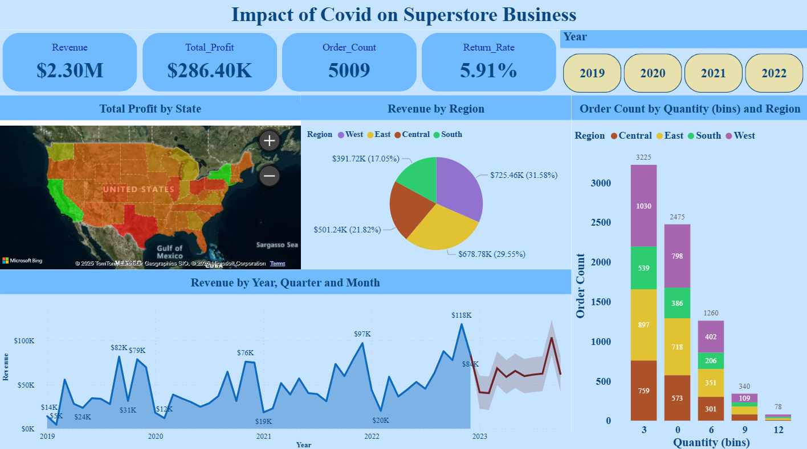
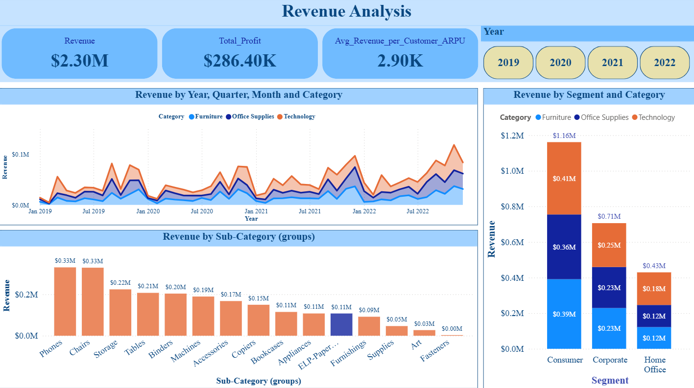
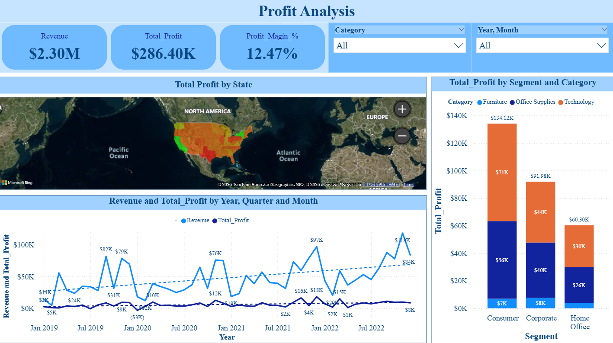

# 💡 Power Bi Project by Yash Yennewar

# Superstore_Project_Analysis
A Power BI project analyzing the impact of Covid on Superstore business performance across revenue, profit, regions, and customer segments.

## 🔗 Project Link :

[Superstore_Project_Analysis](Superstore_Project_Analysis.pbix)

---

## 🌍 Overview :
This project analyzes the Impact of Covid on Superstore Business using Power BI. The analysis covers revenue, profit, customer orders, product categories, and regional performance across the years 2019–2022. It provides insights into how different segments, categories, and regions performed, helping to understand both growth opportunities and challenges during the Covid period.

---

## 🛠️ Skills & Tools :
- Power Query – Data cleaning & preparation.
- Data Analysis - Revenue, Profit, Order Trends, Segmentation.
- DAX Measures - Profit Margin, Average Revenue per Customer (ARPU), Return Rate.
- Business Intelligence Concepts - Customer Segmentation, Regional Analysis, Covid-19 Impact Tracking.
- Data Modeling - Year, Quarter, Month hierarchies for trend analysis.

---

## 🎯 Key Insights  

- **Overall Performance**  
  - Total Revenue: **$2.30M**  
  - Total Profit: **$286.40K**  
  - Orders: **5009**  
  - Return Rate: **5.91%**  
  - Profit Margin: **12.47%**  

- **Regional Analysis**  
  - West: **$725.46K (31.6%)** – highest revenue contributor  
  - East: **$678.78K (29.5%)**  
  - Central: **$501.24K (21.8%)**  
  - South: **$391.72K (17.0%)**  

- **Category & Sub-Category Insights**  
  - Top Revenue Categories: **Technology & Office Supplies**  
  - Phones & Chairs each contributed **$0.33M** in revenue (leading sub-categories)  
  - Lowest performing sub-categories: **Fasteners & Art**  

- **Segment Analysis**  
  - Consumer segment generated the highest revenue (**$1.16M**) and profit (**$134K**)  
  - Corporate & Home Office segments lagged comparatively  

- **Trend Analysis**  
  - Revenue dips observed during early **2020 (Covid onset)**, followed by recovery in **2021–2022**  
  - Strong revenue peaks in late **2022 and early 2023**  

---

## 📚 Learnings - 
- Regional and segment-level analysis helps businesses identify their strongest markets and growth areas.
- Covid significantly disrupted sales in 2020, but certain categories like Technology saw recovery faster than others.
- Consumer-focused strategies drive stronger profitability compared to corporate and home office customers.
- Power BI dashboards provide an effective way to track KPIs (Revenue, Profit, Orders, ARPU, Return Rate) dynamically across years and categories.

---

## 📸 Screenshots :

---

# 💡 Power BI Project by **Yash Yennewar**

# 📊 Superstore_Project_Analysis  
**A Power BI project analyzing the *Impact of Covid* on Superstore business performance across 💵 Revenue, 💹 Profit, 🌍 Regions, and 👥 Customer Segments.**

---

## 🔗 Project Link :  
📂 [**Superstore_Project_Analysis.pbix**](Superstore_Project_Analysis.pbix)  

---

## 🌍 Overview :  
This project provides a detailed analysis of the **Impact of Covid on Superstore Business (2019–2022)** using **Power BI**.  
It highlights key metrics such as **Revenue, Profit, Orders, Return Rate, and Profit Margins**, along with performance breakdowns by **Region, Category, Sub-Category, and Customer Segments**.  

---

## 🛠️ Skills & Tools :  
- ⚡ **Power Query** – Data Cleaning & Preparation  
- 📊 **Data Analysis** – Revenue, Profit, Order Trends, Segmentation  
- 📐 **DAX Measures** – Profit Margin, ARPU (Average Revenue per Customer), Return Rate  
- 🧠 **Business Intelligence Concepts** – Customer Segmentation, Regional Analysis, Covid-19 Impact Tracking  
- 🗂️ **Data Modeling** – Year, Quarter, Month Hierarchies for Trend Analysis  

---

## 🎯 Key Insights  

- **Overall Performance**  
  - 💵 **Total Revenue:** $2.30M  
  - 💹 **Total Profit:** $286.40K  
  - 📦 **Orders:** 5009  
  - 🔄 **Return Rate:** 5.91%  
  - 📈 **Profit Margin:** 12.47%  

- **Regional Analysis**  
  - 🏆 **West:** $725.46K (31.6%) – *Highest Revenue Contributor*  
  - 🌐 **East:** $678.78K (29.5%)  
  - 🏙️ **Central:** $501.24K (21.8%)  
  - 🏡 **South:** $391.72K (17.0%)  

- **Category & Sub-Category Insights**  
  - 🖥️ **Top Revenue Categories:** Technology & Office Supplies  
  - 📱 **Phones & Chairs:** Each contributed $0.33M in revenue (*leading sub-categories*)  
  - ❌ **Lowest Performing:** Fasteners & Art  

- **Segment Analysis**  
  - 👥 **Consumer Segment:** Highest revenue ($1.16M) & profit ($134K)  
  - 🏢 **Corporate & Home Office:** Lagged comparatively  

- **Trend Analysis**  
  - 📉 Revenue dips observed during early **2020 (Covid onset)**  
  - 📈 Recovery in **2021–2022** with strong peaks in **late 2022 & early 2023**  

---

## 📚 Learnings :  
- 🌍 Regional & segment-level insights help businesses identify their **strongest markets** and **growth areas**.  
- 🦠 Covid caused major disruption in **2020**, but categories like **Technology** recovered faster.  
- 👥 **Consumer-focused strategies** deliver stronger profitability compared to corporate/home office customers.  
- 📊 Power BI dashboards make it easy to monitor **KPIs (Revenue, Profit, Orders, ARPU, Return Rate)** across multiple dimensions.  

---

## 📸 Screenshots :  

  
  
  

---

